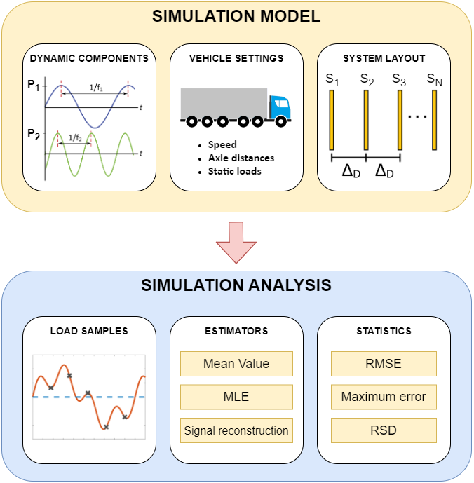

# Weigh-in-Motion Simulator

Weigh-in-motion (WIM) systems are used to measure the loads of vehicles while they are moving, eliminating the need for them to stop on static scales. This simulator has been developed as a tool to test and explore these systems using MATLAB scripts, enabling the simulation of multiple vehicles at different speeds with various system layouts. Since it is impractical to change system layout after installation, simulation serves as a valuable tool for system design and testing.

This simulator was developed as part of the Master of Science program at the School of Mechanical Engineering, State University of Campinas (UNICAMP).

## Description

The following equation defines the vehicle dynamic load signal in this simulation:

$P(t)=P_{0}+P_{1}\cdot sin(2\pi f_{1} t+\phi)+P_{2}\cdot sin(2\pi f_{2} t+\phi)$,

where $f_{1}$ and $f_{2}$ are uniformly distributed variables within the ranges of 1-5 Hz and 8-15 Hz, respectively, and $\phi$ is a uniformly distributed variable between 0° and 359°. The dynamic load amplitudes $P_{1}$ and $P_{2}$ are proportional to vehicle speed, based on the data presented in [(Gajda et al., 2015)](https://ieeexplore.ieee.org/document/7151413).

The gross vehicle weight (GVW) estimation methods, also known as estimators, available in this tool are: **Mean Value**, **Maximum Likelihood Estimator (MLE)**, and **signal reconstruction techniques (Makima, PCHIP, and Spline)**.

As input, this tool reads data from the `config.json` file, which defines the number of vehicles available for simulation and their configuration (number of axles, axle spacing, and static axle load). It also specifies vehicle speeds and system layout parameters (number of sensors, sensor spacing, and sensor uncertainty).

As output, the tool generates two CSV files: axle load estimation results and GVW estimation results. These files contain statistics such as Maximum Relative Error (MRE), Mean Absolute Error (MAE), Root Mean Squared Error (RMSE), and Relative Standard Deviation (RSD) for each estimator.

## How to use it

1. Set simulation parameters in `config.json` file.
2. Run the `wim_simulation.m` script.
3. Output data will be saved in `outputs/axle_output.csv` and `outputs/gvw_output.csv` files.
4. Use the `plot_output_estimators.m` and `plot_output_layout.m` scripts to visualize CSV data from different simulations if needed.

## Additional Information

In addition to this simulator, a review paper has been published in the [IEEE Access Journal](https://ieeexplore.ieee.org/document/10681086) as a part of the Master of Science program. The paper provides general information about sensors, road and weather conditions, system calibration, and weigh-in-motion methods.

## References

[1] J. Gajda et al., "Design and accuracy assessment of the multi-sensor weigh-in-motion system," 2015 IEEE International Instrumentation and Measurement Technology Conference (I2MTC) Proceedings, Pisa, Italy, 2015, pp. 1036-1041. 

[2] E. Oliveira Rocheti and R. Moreira Bacurau, "Weigh-in-Motion Systems Review: Methods for Axle and Gross Vehicle Weight Estimation," in IEEE Access, vol. 12, pp. 134822-134836, 2024. 